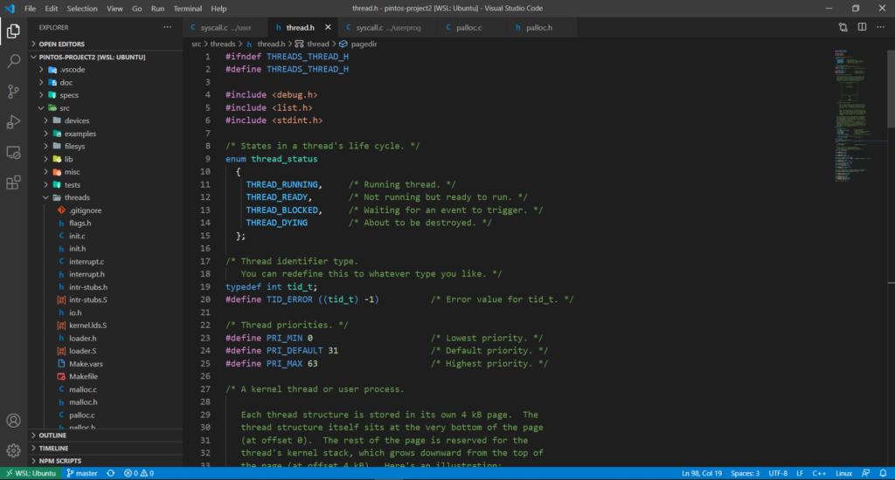

> pintos를 유랑하는 히치하이커를 위한 안내서

## WHAT : pintos가 뭐지?
pintos는 스탠포드 대학에서 운영체제 교육용으로 만든 작은 운영체제(pint + OS) 프레임워크입니다. Vanilla pintos(아무것도 구현되어있지 않은 pintos)는 kernel thread와 user program 로딩 및 실행, file system을 아주 간단한 방식으로 구현하고 있습니다. 프로젝트를 수행하면서 scheduling, virtual memory, file system 등의 기능을 발전시키는 것을 목표로 합니다.

## WHY : 왜 pintos를 사용할까?
가장 많이 알려진 오픈소스 운영체제인 linux의 경우, 현재 전체 코드라인이 100만줄에 달한다고 합니다. 운영체제를 깊이 이해하기 위해서는 실제적으로 각종 개념들을 코드로 구현해보는 과정이 필요한데, 초보자가 읽고 이해하기에는 리눅스의 코드가 너무 방대하고 복잡해버린 것이죠. 이정도 되는 코드의 경우 컴파일 하는 데에만 1시간 이상이 소요된다고 합니다. 학습용으로는 적절하지 않은 것이죠. 그래서 LINUX보다 간단하고, 컴파일 시간도 짧은 pintos를 사용하는 것입니다.

## HOW : 어떻게 시작하지?
### 1. 클론하기
스탠포드 CS140 강의 홈페이지에 pintos의 소스코드를 다운받을 수 있는 링크가 올라와있습니다. linux 환경에서 이 파일을 다운 받고 root 디렉토리에서 압축해제합니다.

### 2. 추가하기
pintos를 루트에 clone한 이후, .bashrc 파일의 가장 아래에 `export PATH="$PATH:~/pintos/src/utils"` 명령어를 추가합니다. 

.bashrc는 bash의 환경설정을 저장해놓는 파일입니다. 흔히들 프로그래머 하면 떠오르는 검은색 화면이 바로 bash입니다. bash는 리눅스 표준 shell입니다. shell은 인간이 컴퓨터에게 명령을 내리는 창구 프로그램입니다. .bashrc 파일은 루트 디렉토리(~)에서 `ls -al`의 명령어로 볼 수 있고, `vi .bashrc` 명령어를 통해 수정할 수 있습니다.

pintos 프로젝트를 실행하기 위해서는 `pintos`라는 이름의 실행코드를 사용해야합니다. 이 코드는 pintos/src/utils 폴더에 담겨 있습니다. 위에서 입력한 명령어는 root 폴더에서부터 pintos 실행파일이 담긴 utils까지의 까지의 경로를 '명령어 검색 path에 포함시키는 과정입니다. 이 과정을 통해 /pintos/src/utils 안에 있는 파일을 `~/pintos/src/utils/pintos`라고 부르는 대신, `pintos`라고 부를 수 있게 됩니다. root 디렉토리에 있더라도 간단히 이름을 호출하는 것만으로도 pintos/src/utils 안에 있는 프로그램을 실행할 수 있따는 것이죠.

### 3. 빌드하기
pintos를 설치한 이후, pintos/src/threads에 들어가 `make` 명령어를 통해 pintos를 빌드할 수 있습니다. pintos가 build되면 threads 폴더 하위에 build 라는 폴더가 생기게 됩니다. make에 대해서는 링크 블로그를 참고하세요.

### 4. 실행하기
build 폴더로 이동해서 `pintos run (프로그램 이름)` 명령어를 입력하면 프로그램을 실행할 수 있습니다 예를 들어 `pintos run alarm-multiple` 과 같이 명령어를 수행하는 것이죠. 이 코드는 pintos가 제공하는 alarm-multiple이라는 테스트 케이스를 실행하는 코드입니다. pintos가 제공하는 모든 테스트케이스에 대한 결과와 점수를 얻고 싶다면 pintos/src/threads/build 폴더에서 `make check` 명령어를 통해 할 수 있습니다.

## 마치며

1. make clean 명령어를 통해 현재 빌드의 결과물들을 모두 삭제할 수 있습니다. 이전 빌드의 결과물이 알 수 없는 오류의 원인이 될 수 있기 때문에, 저의 경우 매번 `make clean;make;pintos run alarm-multiple`을 하나의 명령어처럼 사용하곤 했습니다.

2. pintos를 만든 stanford에서 제공하는 [pintos guide](https://web.stanford.edu/class/cs140/projects/pintos/pintos.pdf "pintos guide")가 있습니다. pintos guide 안에는 설치부터, 각 프로젝트에 대한 상세한 설명이 담겨있으니, 꼭 정독하시기를 권합니다.

3. 이 guide는 다음과 같은 어구로 시작합니다. "These projects are hard. They have a reputation of taking a lot of time, and deservedly so" 그렇습니다. pintos는 모두에게 어렵고, 많은 시간을 요구하는 과제입니다. pintos가 제시하는 프로젝트를 마치고 나면, 운영체제를 지금보다 훨씬 더 잘 이해한 상태가 되어있을 겁니다.