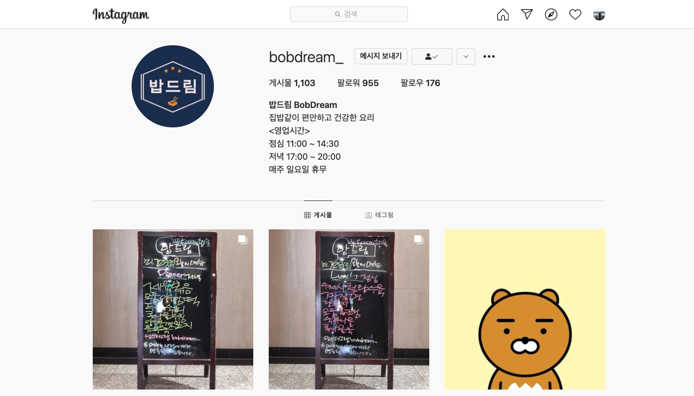
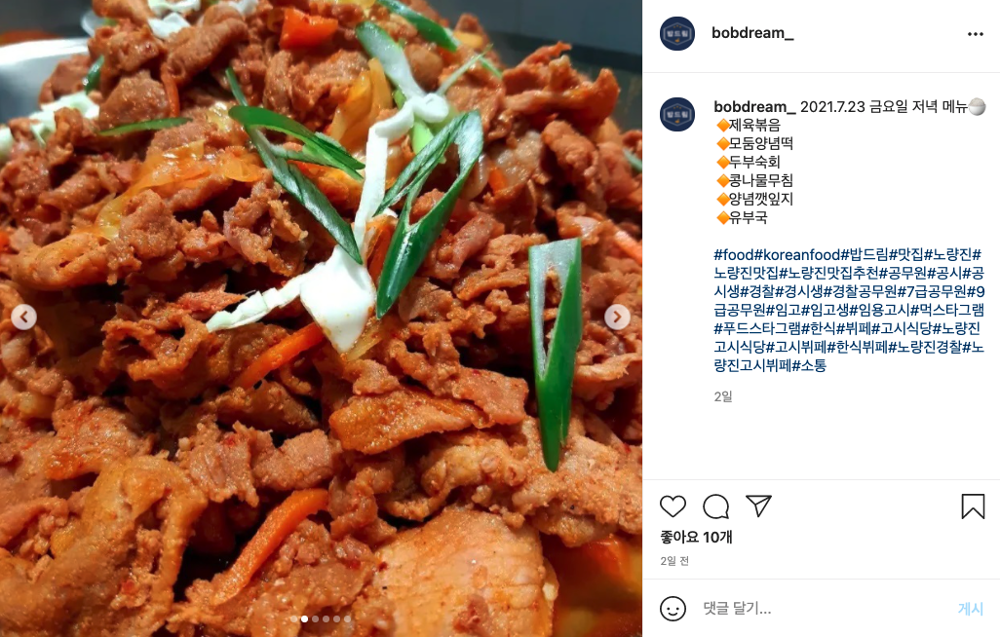
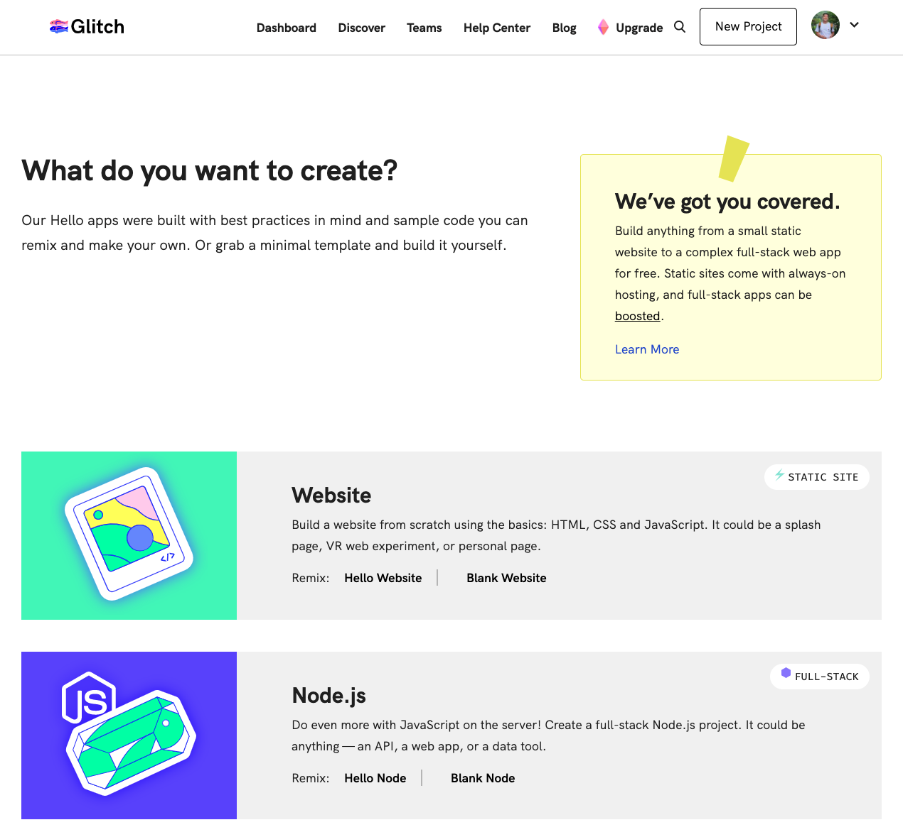
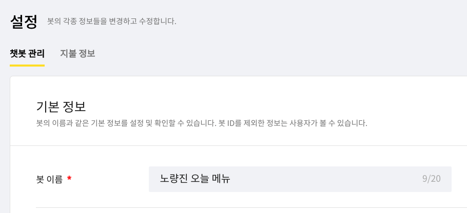
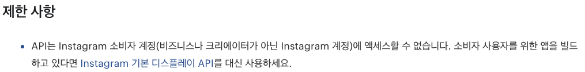

 
재택근무를 하고 있는 요즘엔, 매 끼니를 해결하는 일이 큰 어려움이다. 재택근무 초기에는 직접 요리를 해먹기도 했으나, 조리 시작부터 설거지 완료까지 1시간이 꼬박 소요되는 통에, `점심시간 != 휴게시간`이 되어버리는지라, 주로 밖에 나가 밥을 사먹고 온다. 하루종일 집안에만 머물기에 답답한 이유도 있다.

다행히 노량진 자취방 근처에는 5,000~6,000원에 백반을 판매하는 고시식당이 여러 곳 있다. 식당들끼리도 경쟁이 붙었는지 메뉴가 날이 갈수록 다양해지고 맛있어진다. 심지어는 매일 11시 즈음 식당의 인스타그램 계정을 통해 그 날의 메뉴를 공유하고 있어, 인스타그램을 보며 어느 고시식당에 방문할지 고민하는 것이 하나의 재미요소이기도 하다.

그런데 나는 인스타그램 앱을 스마트폰에서 지운지 오래인지라, 매번 웹을 통해 인스타그램에 접속하고, 식당의 계정을 검색해 최근 게시글을 열어보는 일이 나에게는 큰 귀찮은 일 중 하나였다. 그러던 중 스친 생각.

> '그날 고시식당 메뉴를 카카오톡으로 보내주는 봇을 만들면 어떨까?' 

## 계획
### Concept
Cron job으로 식당 인스타그램 최신 포스트에서 메뉴 이미지를 크롤링. 식사 시간 직전 카톡봇을 이용해 팔로워들에게 이미지 전송. 20장 정도의 이미지를 서버에 다운로드했다가 카톡 전송 이후 flush.

### Tool
Platform as a Servicec의 한 종류인 [Glitch](https://glitch.com/)에 Node.js로 서버를 만들기로. Glitch는 이전에 슬랙봇을 만들 때 사용한 적이 있는데, 코드 작성과 동시에 알아서 디플로이해줘서 간단한 프로젝트에 적합하다고 판단. 또한 Node.js 프로젝트의 보일러플레이트를 제공하는 것도 장점.

## 실행
먼저, 카카오톡 채팅 봇을 만들었다. 봇 이름은 추후에 수정하기로 하고, 일단은 앱의 특성을 가장 잘 나타내는 이름인 '노량진 오늘 메뉴'라고 붙였다. 슬랙의 웹훅처럼 외부 트리거에 의해 카톡을 보낼 수 있는 기능이 구현되어 있음을 간략하게만 확인하고, 곧바로 인스타그램 파트로 넘어갔다.

Instagram이 제공하는 API를 이용할 계획이었다. 인스타그램 사진을 모조리 긁어와 태그별로 모아놓는 써드파티 웹사이트들이 있는 걸 보니 분명 포스팅을 긁어오는 API가 있을 것이라고 생각했기 때문. 그러나.. 

다른 사람의 포스팅을 읽어오는 API가 제공되지 않았다. 살펴보니, 어느 버전 이후로 막아놓은듯 했다. (프라이버시 이슈인가)

## 계획 수정
API를 막아놓았다면 어쩔 수 없이 수작업으로 하는 수 밖에. Python 과 Selenium으로 브라우저 자동화를 통해 그 날의 메뉴 이미지를 저장하기로 결정. 서버 상의 컴퓨터에서 selenium을 구동해야 하기 때문에 이를 위한 driverpack을 제공하는 heroku로 변경(glitch -> heroku) 

---
다음 포스팅에 이어서..
