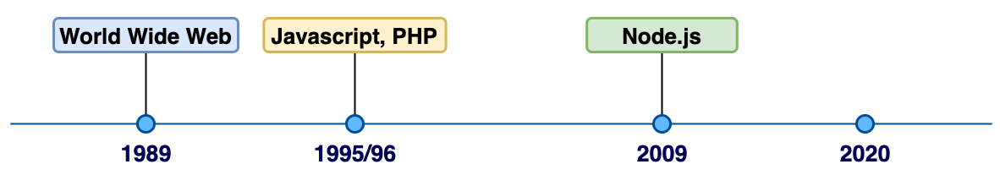
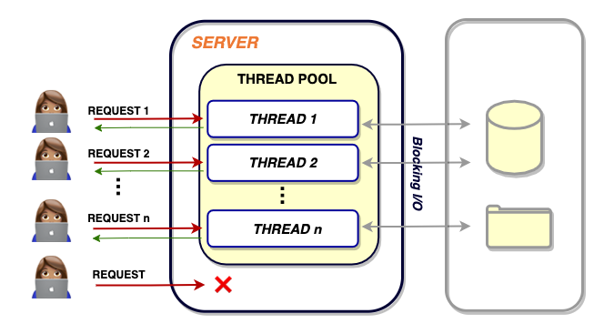

원문 - [Node.js Architecture and 12 Best Practices for Node.js Development](https://scoutapm.com/blog/nodejs-architecture-and-12-best-practices-for-nodejs-development#abriefhistory)

---

### Overall

이제 겨우 11년 밖에 되지 않았지만, Node.js는 지난 10년 동안 가장 인기 있는 웹 개발 프레임워크로 부상했습니다. 저는 자바스크립트의 팬입니다! (역주 - 저도요!) 이제 Node.js 덕분에 브라우저 바깥에서도 Javascript 코드를 작성해 비동기로 작동하면서, 가볍고, 빠르고, 확장성이 뛰어난 서버-사이드 웹 애플리케이션을 만들 수 있게 되었습니다.

이 게시물에서는 Node.js의 프로그래밍의 두 가지 측면에 대해 이야기하고자 합니다. 첫째는 node js 프레임워크의 내부 메커니즘이고, 둘째는 효율적이고 지속 가능한 애플리케이션을 만들기 위한 node.js의 best practice에 대한 것입니다.

프레임워크 내부 작동 방식을 이해하려는 노력을 통해 프레임워크 자체에 대한 지식 뿐만 아니라, 프로그래밍 패러다임과 디자인 결정 과정에서의 통찰을 배울 수 있습니다. 이러한 low-level에서의 통찰력과 지식은 시간이 지남에 따라 코드를 작성하는 방식에 반영되고, 속도와 성능을 위해 애플리케이션을 최적화할 수 있는 방법에 대한 이해를 높입니다. 

node.js의 가장 중요한 특징 중 하나는 이벤트 루프 기반의 싱글 스레드 기반으로 작동한다는 사실입니다. 우리는 이 글의 전반부(Part 1)에서 이것을 더 깊이 탐구할 것입니다.

이 게시물의 후반부(Part 2)는 스펙트럼의 다른 쪽 끝을 다룹니다. 신규 Node.js 프로젝트를 시작할 때 알아두면 좋은 12가지 best practice를 알아보겠습니다. 이 부분에서는 전체 아키텍처, 폴더 구조, 모듈화, 클린 코드 작성, dependency 관리 등의 측면에서 견고한 애플리케이션을 만드는 방법에 대해 알아보겠습니다.

이 게시물을 통해 다음 질문에 답하고자 합니다. 

- Node.js는 내부적으로 어떻게 동작하는지?
- Concurrency(동시성)을 어떻게 달성하는지?
- 다른 멀티 스레드 웹 프레임워크와 비교했을 때 어떤지?
- 잘 세팅된 Node.js 프로젝트는 어떻게 생겼는지?
- Node.js 애플리케이션을 세팅할 때, 명심해야 할 점들은?

## node.js의 역사

월드 와이드 웹(WWW)은 약 30년 전에 시작되었습니다. 자바스크립트는 약 25년 전에 태어났으며, PHP도 26년으로 비슷합니다. 반면에 Node.js는 아직 11년 밖에 되지 않았습니다. 상대적으로 짧은 기간임에도 불구하고, Node.js는 전 세계의 개발 조직에서 놀라운 성과를 거두었습니다. 

자바스크립트가 출시된 이후, 백엔드에도 자바스크립트를 도입하려는 시도가 있었습니다. 예를 들어, 넷스케이프는 Netscape Livewire와 같은 시도를 하기도 했습니다. 결국 성공하지 못했지만요. 2004년 이후, 웹 2.0의 첫 파도가 시작되었을 때, 자바스크립트는 '현대적인 웹 경험'이라는 비전을 앞세워 많은 관심을 끌었습니다. 자바스크립트는 가장 널리 사용되는 클라이언트 프로그래밍 언어였기 때문에, 많은 브라우저는 최상의 성능을 위해 앞다퉈 최적화된 자바스크립트 엔진을 만들기 위해 경쟁했습니다. 이러한 엔진 중 하나가 바로 Chrome의 V8 엔진이었으며, 이 엔진을 기반으로 Node.js가 제작되게 되죠. 이러한 경쟁의 결과로 자바스크립트는 더욱 번창했고, V8 엔진도 역시 번창하게 되었습니다.

2009년, 가장 적절한 시기에 Node.js가 태어났습니다. 그 이후로 Node.js 개발은 폭발적으로 증가했죠. PHP, Advanced Java등 선점자들이 있었음에도 불구하고, Node.js는 비동기 I/O, 이벤트 기반 아키텍처, 가벼움, 속도, 확장성, 그리고 (가장 인기 있는 프로그래밍 언어인) 자바스크립트를 사용합니다는 사실 덕분에, 많은 애플리케이션에서 선호하는 서버 사이드 선택지로 부상했습니다. 현재 Node.js 서버는 Netflix, Linkedin, Microsoft, GoDaddy, Paypal 등 전 세계 수억 명의 사용자가 있는 애플리케이션 및 엔터프라이즈용 개발에 사용되고 있습니다. Node.js가 얼마나 인기 있는지 대략 귀띔해주자면, npm 패키지 관리자에는 매주 수십억 건의 다운로드가 일어납니다.

Node.js는 방대한 사용자/개발자 커뮤니티 덕분에 활발하게 유지/관리되고 있습니다. 이것은 또한, 만약 여러분이 코드나 일반적인 웹 개발 조언에 도움이 필요하다면, 인터넷을 통해 많은 도움을 얻을 수 있다는 것을 의미하기도 합니다 :)

그럼 Node.js의 내부가 어떻게 작동하는지 알아볼까요?

## Background: node.js는 어떻게 작동하고 있을까?

Node.js는 이벤트 기반 비동기 I/O 프로세싱이 필요한 곳에 널리 사용됩니다. Node.js는 이 동시성(Concurrency)과 비동기성(Asynchronism)의 대부분을 자바스크립트의 '싱글 스레드 이벤트 루프 모델'에서 가져옵니다.

Node.js의 대체제로 알려진 다른 웹 개발 도구들(ex. ASP.NET, JSP, Spring)은 '다중 스레드 프로세싱 아키텍처'를 사용하여 동시에 들어오는 클라이언트 요청을 처리할 수 있습니다. 이러한 다중 스레드 모델을 자세히 살펴보고, 이것과 Node.js를 비교해봅시다.

### 멀티 스레드 웹 프레임워크

멀티 스레드 프로세싱 셋업에서 각 서버는 스레드 풀 사용에 제한이 있습니다. 서버는 클라이언트로부터 요청이 들어올 때마다, 풀에서 스레드를 선택하여 클라이언트의 요청에 할당합니다. 이 스레드로 해당 요청과 관련된 모든 처리를 처리하는 식이지요. 이러한 스레드 내부에서는 처리가 순차적(Sequential)이고 동기적(Synchronous)입니다. 즉, 한 번에 한 번의 작업이 수행되지요. 그럼에도 불구하고, 서버에 새롭게 요청이 들어오면, 풀에서 사용 가능한 쓰레드를 가져와 임무를 수행할 수 있습니다.

이 작업은 모든 스레드가 다 소진될 때까지 계속됩니다. 만약 모든 스레드가 요청에 할당된 경우, 서버는 사용 중인 쓰레드 중 하나가 해제될 때까지 기다리고 있어야 합니다. 이는 결국 애플리케이션을 느리고 비효율적으로 만들죠. 또한, 각 스레드가 가진 동시적 특성(Synchronism)은 blocking code에 의해 속도가 매우 느려질 수 있습니다. 이와 같은 멀티 스레드는 '스레드 간 동기화' 및 '관리' 문제를 야기합니다. 또 여러 스레드가 하나의 리소스를 확보하기를 기다리는 과정에서 데드락이 발생할 위험도 있습니다.

Node.js는 이 문제를 어떻게 해결했을까요?

### 싱글 스레드 이벤트 루프 아키텍쳐

'Node.js는 모든 작업을 하나의 스레드로만 수행한다'는 것은 유명하지만, 사실 여기에는 많은 혼란이 있습니다. 도대체 그게 어떻게 가능할까요? 어떻게 하나의 스레드만으로 다른 멀티스레드 프레임워크와 경쟁할 수 있는 걸까요?

알다시피, Node.js는 Chrome의 V8 자바스크립트 엔진 위에 구축된 자바스크립트 런타임입니다. 즉, Node.js는 자바스크립트 싱글 스레드 아키텍처가 기반이고, 따라서 클라이언트 요청이 있을 때마다 하나의 기본 스레드로 처리됩니다. **이벤트 루프**는 Node.js가 blocking I/O 작업에 의해 blocking되지 않는 방식으로 작동되게 하는 구성 요소입니다. 이 기능은 비동기 작업(ex. 콜백)의 상태를 지속적으로 추적해, 비동기 작업이 완료되면 그것을 다시 실행 대기열로 옮기는 역할을 합니다. 이벤트 루프는 앞서 이야기했던 그 '단일한 스레드'에서 작동합니다.

흥미로운 점은 겉으로 보기에 메인 스레드가 하나로 보이지만, 시스템 커널 안에는 Node.js가 활용할 수 있는 수많은 도움 스레드(auxiliary thread)가 있다는 겁니다. 이 도움 스레드들을 빡센(?) 디스크, 네트워크 기반 비동기 작업에 활용할 수 있는 거지요. 이 스레드 그룹은 작업자 풀(worker pool)을 구성합니다.

이벤트 루프는 기본적인 프로세싱을 처리할 수 있지만, fs(=file system, I/O-heavy)나 crypto(CPU-heavy)와 같은 모듈이 포함된 비동기 I/O 작업의 경우, 프로세싱을 시스템 커널의 작업자 풀로 떠넘겨 버립니다. 작업자 풀은 [libuv](http://docs.libuv.org/en/v1.x/)로 구현되어 필요에 따라 여러 스레드를 생성하고 관리할 수 있습니다. 이렇게 생성된 작업자 스레드들은 할당된 업무를 동기식(synchronous)으로 처리하고, 완료되면 이벤트 루프에 응답을 반환합니다. 이처럼 작업자 스레드가 할당된 작업에서 처리하는 동안, 이벤트 루프는 다른 요청을 계속 수용하면서 평소와 같이 계속 작동할 수 있는거죠. 작업자 스레드에서 완료된 결과물은 이벤트 루프를 거쳐, 다시 실행 대기열에 배치되거나 클라이언트로 반환됩니다.

이러한 아키텍처 디자인 이면에는, 일반적인 웹 부하에서는 싱글 메인 스레드가 멀티 스레드 아키텍처에 비해 훨씬 더 나은 성능과 확장성을 제공할 수 있다는 생각이 자리잡고 있습니다. 결과적으로 Node.js는 사람들에게 속도와 확장성을 인정받게 됐지요. 하지만, 여기서 주의할 점은 이미지 프로세싱, 데이터과학 및 머신러닝 애플리케이션을 위한 행렬 곱셈 등 메모리 intensive한 작업의 경우 성능이 매우 저하될 수 있다는 것입니다. 하나뿐인 메인 스레드가 블라킹되어 서버가 응답하지 않을 수도 있는거죠 X( 하지만 Node.js 개발자들은 이러한 경우에도 효율적으로 대응할 수 있도록 작업자 풀을 도입해 다중 스레드를 지원하게 만들었습니다.

자바스크립트로 비동기 코드를 짜는 것에 관심이 있다면, 우리 블로그의 [비동기 자바스크립트: Promises와 Async/Await](https://scoutapm.com/blog/async-javascript)도 읽어보세요.
