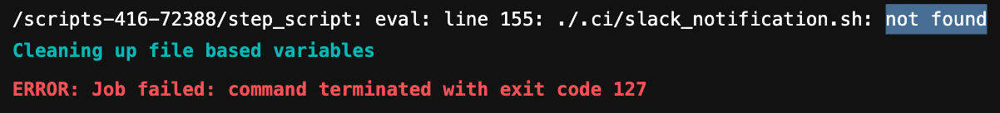
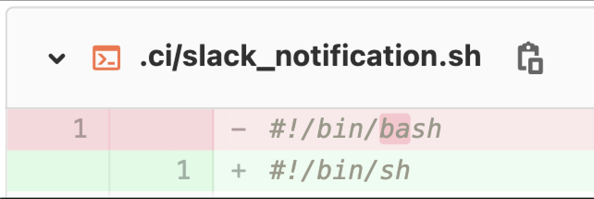
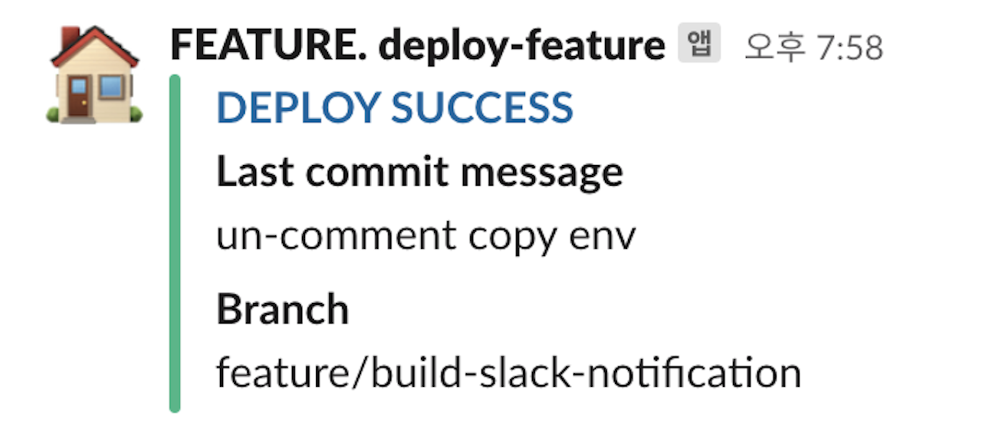

## 문제 발견
* 내가 속한 플랫폼 팀에서는 gitlab CI/CD를 사용하고 있음
* CI/CD 결과(success/fail)를 slack으로 받아보기 위한 코드 작업을 맡아 진행했음
* 슬랙에 notification을는날리는 쉘 스크립트를 먼저 작성하고, gitlab-ci.yml의 적절한 위치에서 이 스크립트를 호출하는 식으로 구현함
- 알 수 없는 이유로 `not found`에러가 발생하면서 코드가 실행되지 않았음



## 추론 과정
### 가설 0. Typo
  * 파일명을 잘못 입력했을 가능성 (가장 먼저 확인해봐야함) 
  - (불행인지 다행인지) 파일명은 제대로 입력되어 있었음

### 가설 1. 실행권한이 없음
  - `ls -al`로 파일의 권한을 확인해본 결과, execute 권한은 부여된 상태
  - 만약 execute 권한이 없었다면 `permission denied` 에러가 났을 것임
```shell
-rwxr-xr-x   1 jinu  staff  1200 Sep 16 18:26 slack_notification.sh
```

### 가설 2. 파일이 가려져서 보이지 않음
  - 여러가지 방법으로 확인해보았으나 너무나 파일이 잘 보임. 사건은 점점 미궁 속으로..
```shell
ls -al                              # 리스트에 보임
cat slack_notification.sh           # 출력됨
find . name "slack_notification.sh" # 찾아짐
```

### 가설 3. shell executer의 문제
  - 원하는 shell executer를 지정해 스크립트를 실행하는 [방법](https://docs.gitlab.com/runner/shells/#shbash-shells)을 찾음
```shell
cat 'slack_notification.sh' | /bin/bash
```
  - CI/CD 로그에서 본 것과 똑같은 not found 에러가 발생 
  - (이때 머리 속을 스치는 무언가!)
		

## 해결
- 우리 서버의 CI/CD 과정은 빈 도커 이미지를 다운받아 진행함. 이렇게 만든 컨테이너는 매우 단순해서 bash조차 없음! 
- 내가 실행하고자 했던 'slack_notification.sh'의 상단에는 `#!/bin/bash`(shebang)이 포함되어 있었는데, 이는 `/bin/bash` 프로그램을 찾아 아래 스크립트를 실행해달라는 의미. 
- 컨테이너에 `/bin/bash`가 없으니 not found 에러가 날 수 밖에!
- `#!/bin/bash`  -> `#!/bin/sh` 로 수정하니 문제가 해결됨





## 참고
[Shebang (Unix) - Wikipedia](https://en.wikipedia.org/wiki/Shebang_(Unix))

